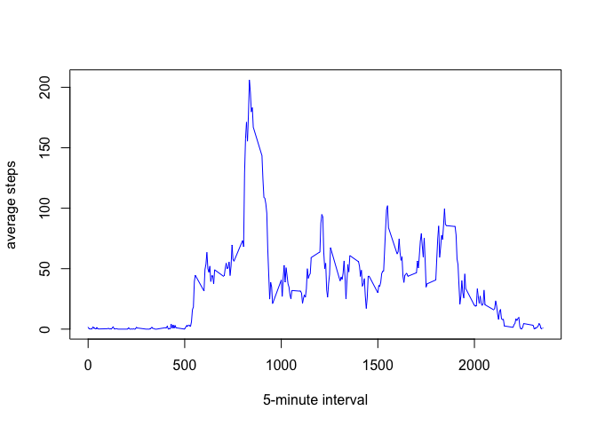
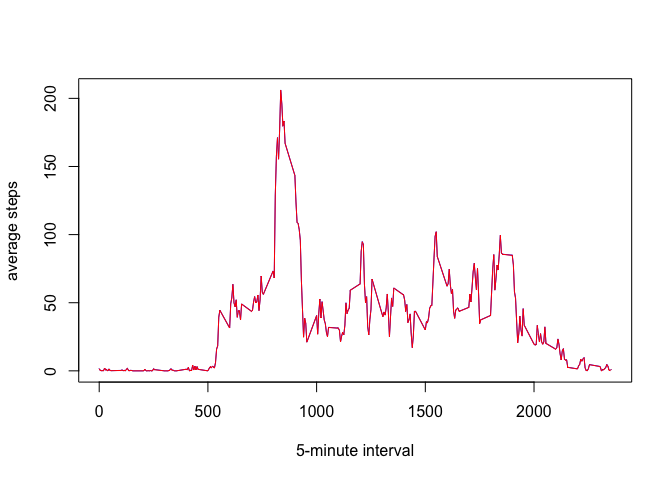

# Reproducible Research: Peer Assessment 1


## Loading and preprocessing the data

```r
###load libraries
library(dplyr)
```

```
## 
## Attaching package: 'dplyr'
## 
## The following object is masked from 'package:stats':
## 
##     filter
## 
## The following objects are masked from 'package:base':
## 
##     intersect, setdiff, setequal, union
```

```r
library(lubridate)
library(lattice)
###Loading and preprocessing the data
fileUrl <- "http://d396qusza40orc.cloudfront.net/repdata%2Fdata%2Factivity.zip"
download.file(fileUrl, "activity.zip")
unzip("activity.zip")
activity.with.na <- read.csv("activity.csv") 
activity <- activity.with.na %>% filter(!is.na(steps))
```
## What is mean total number of steps taken per day?
### Make a histogram of the total number of steps taken each day

```r
steps_by_date <- activity %>% group_by(date) %>% summarise(steps = sum(steps))
hist(steps_by_date$steps, main = "Daily Steps Histogram", 
     xlab = "Steps per day", ylim = c(0, 40))
```

 

### Calculate and report the mean and median total number of steps taken per day

```r
mean(steps_by_date$steps)
```

```
## [1] 10766.19
```

```r
median(steps_by_date$steps)
```

```
## [1] 10765
```
Mean is **1.0766189\times 10^{4}**.  
Median is **10765**.  

## What is the average daily activity pattern?
### Make a time series plot (i.e. type = "l") of the 5-minute interval (x-axis) and the average number of steps taken, averaged across all days (y-axis)

```r
average.daily <- activity %>% group_by(interval) %>% summarise(avgsteps = mean(steps))
plot(average.daily$avgsteps ~ average.daily$interval, type = "l", 
     xlab = "5-minute interval", ylab = "average steps", col = "blue")
```

 

### Which 5-minute interval, on average across all the days in the dataset, contains the maximum number of steps?

```r
maxsteps <- max(average.daily$avgsteps)
average.daily %>% filter(avgsteps == maxsteps)
```

```
## Source: local data frame [1 x 2]
## 
##   interval avgsteps
## 1      835 206.1698
```
The maximum average number of steps is **206.1698113** and it occurs at **8:35** interval.  

## Inputing missing values
### Calculate and report the total number of missing values in the dataset (i.e. the total number of rows with NAs)

```r
activity.with.na %>% filter(is.na(steps)) %>% summarise(n()) %>% print
```

```
##    n()
## 1 2304
```
### Devise a strategy for filling in all of the missing values in the dataset. The strategy does not need to be sophisticated. For example, you could use the mean/median for that day, or the mean for that 5-minute interval, etc.
The strategy we're going to use is to replace NA values with average number of steps (rounded down) for that same interval.  


```r
### doing the "mean for that 5-minute interval" strategy
### creating a function to return average steps for a particular interval
### apparently the data to be used in the function must have different column names
avgref <- average.daily
names(avgref) <- c("int", "avg")
averageStepsAt <- function(atInterval) {
  avgref %>% filter(int == atInterval) %>% select(avg) %>% as.integer
  #as.integer(avgref[avgref$int == atInterval, "avg"]) #also works, does the same thing
}
```
### Create a new dataset that is equal to the original dataset but with the missing data filled in.

```r
### selecting only NA records
activity.filled <- activity.with.na %>% filter(is.na(steps)) 
### replace NA with average steps for that particular interval
activity.filled$steps <- apply(activity.filled %>% select(interval), 1, averageStepsAt)
### combine the non-NA records
activity.filled <- rbind(activity, activity.filled)

average.daily.filled <- activity.filled %>% 
  group_by(interval) %>% 
  summarise(avgsteps = mean(steps))
### combine and compare the two averages data
both.averages <- cbind(average.daily, average.daily.filled %>% select(avgsteps))
names(both.averages) <- c("int", "avg1", "avg2")
both.averages <- both.averages %>% mutate(diff = avg1 - avg2)
summary(both.averages$diff)
```

```
##    Min. 1st Qu.  Median    Mean 3rd Qu.    Max. 
## 0.00000 0.02227 0.05444 0.05701 0.08908 0.12870
```
As can be seen, the differences are very low between the original data and filled data.  


```r
### plot both with blue and red color
plot(both.averages$avg1 ~ both.averages$int, type = "l", 
     xlab = "5-minute interval", ylab = "average steps", col = "blue")
lines(both.averages$avg2 ~ both.averages$int, col = "red")
```

 

### Make a histogram of the total number of steps taken each day

```r
steps_by_date.filled <- activity.filled %>% 
  group_by(date) %>% 
  summarise(steps = sum(steps))
hist(steps_by_date.filled$steps, main = "Daily Steps Histogram (filled data)", 
     xlab = "Steps per day", ylim = c(0, 40))
```

 

### Calculate and report the mean and median total number of steps taken per day

```r
mean(steps_by_date.filled$steps)
```

```
## [1] 10749.77
```

```r
median(steps_by_date.filled$steps)
```

```
## [1] 10641
```
Mean is **1.074977\times 10^{4}**.  
Median is **10641**.  
Differences:  

```r
mean(steps_by_date.filled$steps) - mean(steps_by_date$steps)
```

```
## [1] -16.41819
```

```r
median(steps_by_date.filled$steps) - median(steps_by_date$steps)
```

```
## [1] -124
```

## Are there differences in activity patterns between weekdays and weekends?
### Create a new factor variable in the dataset with two levels – “weekday” and “weekend” indicating whether a given date is a weekday or weekend day.

```r
activity.filled$daytype <- ifelse(weekdays(as.Date(activity.filled$date)) %in% 
                                    c("Saturday", "Sunday"), "weekend", "weekday")
activity.filled$daytype <- as.factor(
  ifelse(weekdays(as.Date(activity.filled$date)) %in% 
           c("Saturday", "Sunday"), "weekend", "weekday"))
```

### Make a panel plot containing a time series plot (i.e. type = "l") of the 5-minute interval (x-axis) and the average number of steps taken, averaged across all weekday days or weekend days (y-axis).

```r
average.daily.filled <- activity.filled %>% 
  group_by(daytype, interval) %>% 
  summarise(avgsteps = mean(steps))
xyplot(avgsteps ~ interval | daytype, average.daily.filled, 
       xlab = "Interval", ylab = "Number of steps",
       type = "l", layout = c(1, 2))
```

 
